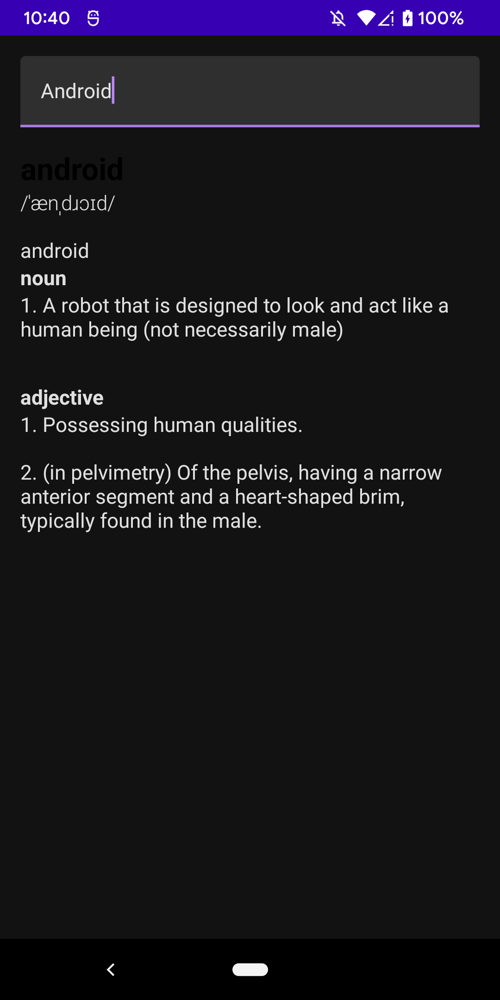
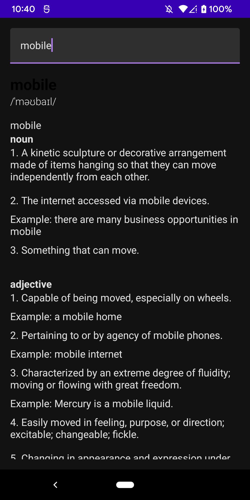
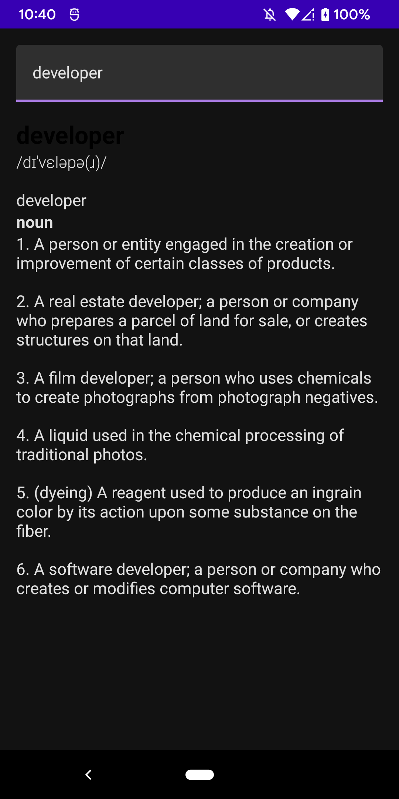

# NiceDictionary

### **Overview - About this project**
This is a simple Dictionary App using Clean Architecture (MVVM, Use Cases, Compose) and also Kotlin Flow

For this API is used:
Dictionary API
[coinpaprika.com](https://dictionaryapi.dev/)

Sample route:
https://api.dictionaryapi.dev/api/v2/entries/en/bank

### 📷 How is this App
</img>
</img>
</img>

### 💻Technology
- [Kotlin](https://kotlinlang.org/)
- [Jetpack Compose](https://developer.android.com/jetpack/compose)
- [Dagger Hilt](https://dagger.dev/hilt/)
- [Kotlin Flow](https://developer.android.com/kotlin/flow)

### References
- https://www.youtube.com/watch?v=Mr8YKDh3li4
 
### Donation
If this project help you reduce time to develop, you can buy me a cup of coffee :) 

